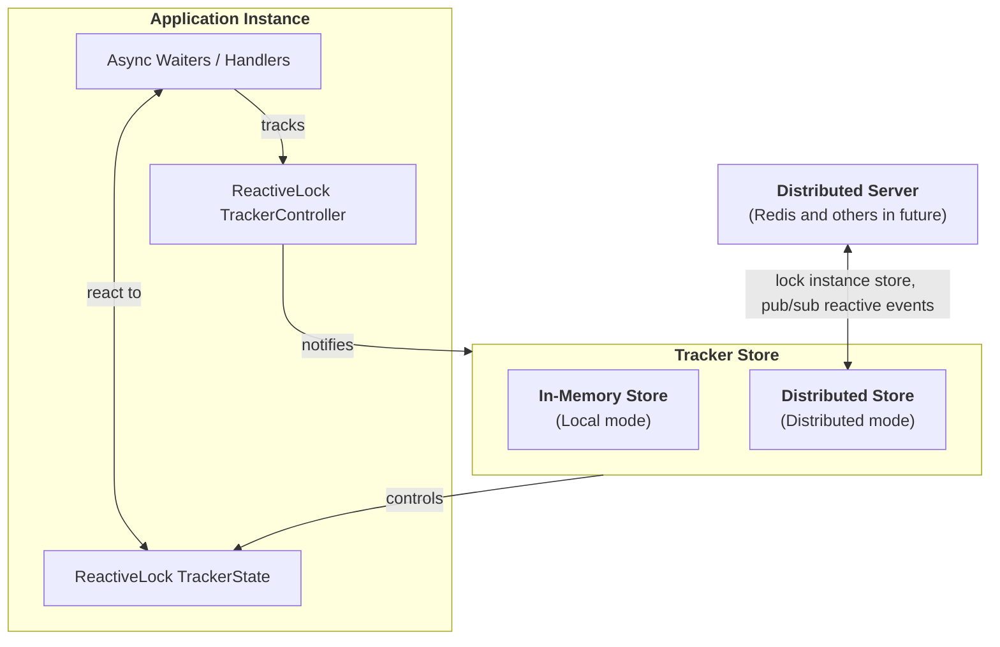

# ReactiveLock

ReactiveLock is a .NET 9 library for reactive, distributed lock coordination. It allows multiple application instances to track busy/idle state and react to state changes using async handlers.

It supports both in-process and distributed synchronization. Redis is the default distributed backend.

[](https://github.com/micheloliveira-com/ReactiveLock/actions/workflows/sonarqube.yml)

[](https://sonarcloud.io/summary/new_code?id=micheloliveira-com_ReactiveLock)

[](https://sonarcloud.io/summary/new_code?id=micheloliveira-com_ReactiveLock)

[](https://sonarcloud.io/dashboard?id=micheloliveira-com_ReactiveLock)
[](https://sonarcloud.io/dashboard?id=micheloliveira-com_ReactiveLock)
[](https://sonarcloud.io/dashboard?id=micheloliveira-com_ReactiveLock)
[](https://sonarcloud.io/dashboard?id=micheloliveira-com_ReactiveLock)
[](https://sonarcloud.io/dashboard?id=micheloliveira-com_ReactiveLock)
[](https://sonarcloud.io/dashboard?id=micheloliveira-com_ReactiveLock)
[](https://sonarcloud.io/dashboard?id=micheloliveira-com_ReactiveLock)
[](https://sonarcloud.io/dashboard?id=micheloliveira-com_ReactiveLock)
[](https://sonarcloud.io/dashboard?id=micheloliveira-com_ReactiveLock)
[](https://sonarcloud.io/dashboard?id=micheloliveira-com_ReactiveLock)
[](https://sonarcloud.io/dashboard?id=micheloliveira-com_ReactiveLock)

## Packages

| Badges                                                                                                        | Package Name                                    | Description                                               |
|---------------------------------------------------------------------------------------------------------------|------------------------------------------------|-----------------------------------------------------------|
| [](https://www.nuget.org/packages/ReactiveLock.Core) [](https://www.nuget.org/packages/ReactiveLock.Core) | **[ReactiveLock.Core](https://www.nuget.org/packages/ReactiveLock.Core)**                | Core abstractions and in-process lock coordination        |
| [](https://www.nuget.org/packages/ReactiveLock.DependencyInjection) [](https://www.nuget.org/packages/ReactiveLock.DependencyInjection) | **[ReactiveLock.DependencyInjection](https://www.nuget.org/packages/ReactiveLock.DependencyInjection)** | Adds DI and named resolution for distributed backends     |
| [](https://www.nuget.org/packages/ReactiveLock.Distributed.Redis) [](https://www.nuget.org/packages/ReactiveLock.Distributed.Redis) | **[ReactiveLock.Distributed.Redis](https://www.nuget.org/packages/ReactiveLock.Distributed.Redis)**     | Redis-based distributed lock synchronization              |

> Use only ReactiveLock.Core if you don't need distributed coordination.

## Installation

In-process only:

```bash
dotnet add package ReactiveLock.Core
```

Distributed with Redis:

```bash
dotnet add package ReactiveLock.Core
dotnet add package ReactiveLock.DependencyInjection
dotnet add package ReactiveLock.Distributed.Redis
```

## Core architecture

ReactiveLock is designed with an **in-memory-first awareness model**, but actual lock control depends on the configured mode:

- In **local-only mode**, all lock transitions (`IncrementAsync`, `DecrementAsync`, etc.) are performed entirely in memory, with no external calls.
- In **distributed mode**, lock transitions are **resolved through the distributed backend** (such as Redis), and only then is the local state updated. This ensures consistent coordination across all instances.

This design enables responsive, high-performance event-driven behavior while supporting multi-instance environments through external synchronization.

### Trade-offs of this architecture

- Lock control is **fast and isolated** in local-only mode.
- In distributed mode, **synchronization latency depends on the backend**, and may be affected by Redis performance or pub/sub delays.
- ReactiveLock provides **no strong consistency guarantees**. It focuses on **reactive propagation and eventual convergence**, not atomic operations.

### Consistency and Usage Considerations

1. It is designed for **reactive and near real-time lock coordination, propagation, and notification**.
2. It offers a **practical alternative to traditional eventual consistency**, supporting **preemptive orchestration** of processes before critical events.
3. Lock propagation delays may occur due to workload, thread pool pressure, or (in distributed mode) Redis latency.
4. For workloads requiring strong consistency, ReactiveLock should be **combined with transactional layers** or **used as a complementary coordination mechanism**, not as the sole source of truth.

#### Note: Distributed failure and contention mitigation features are a work in progress. Use distributed mode with awareness of its current limitations.

Given this, you can observe:
#### Architecture Diagram


## Usage

### Simpler approach – Local-only (in-process)
Use this when you want a lightweight, in-memory, thread-coordinated lock mechanism within a single process.
```csharp
using MichelOliveira.Com.ReactiveLock.Core;

// Create a new tracker state instance
var state = new ReactiveLockTrackerState();

// Set the local state as blocked (simulates a lock being held)
await state.SetLocalStateBlockedAsync();

// Start 3 tasks that will each wait for the state to become unblocked
var tasks = Enumerable.Range(1, 3).Select(i =>
    Task.Run(async () => {
        Console.WriteLine($"[Task {i}] Waiting...");

        // Each task will wait here until the state becomes unblocked
        await state.WaitIfBlockedAsync();

        // Once unblocked, this message will print
        Console.WriteLine($"[Task {i}] Proceeded.");
    })
).ToArray();

// Simulate a delay before unblocking the state
await Task.Delay(1000);

// Unblock the state (releases all waiting tasks)
await state.SetLocalStateUnblockedAsync();

// Wait for all tasks to complete
await Task.WhenAll(tasks);

// Indicate completion
Console.WriteLine("Done.");

```

### Controller-based (Increment / Decrement) local-only sample
Use this when you prefer reference-counted control using a controller abstraction (IncrementAsync / DecrementAsync), ideal for more complex coordination.
```csharp
using MichelOliveira.Com.ReactiveLock.Core;
using System;
using System.Linq;
using System.Threading.Tasks;

var state = new ReactiveLockTrackerState();
var store = new InMemoryReactiveLockTrackerStore(state);
var controller = new ReactiveLockTrackerController(store);

// Initially block the state by incrementing (e.g. lock acquired)
await controller.IncrementAsync(); // Blocked

var tasks = Enumerable.Range(1, 3).Select(i =>
    Task.Run(async () =>
    {
        Console.WriteLine($"[Task {i}] Waiting...");
        await state.WaitIfBlockedAsync(); // Wait while blocked
        Console.WriteLine($"[Task {i}] Proceeded.");
    })
).ToArray();

// Simulate some delay before unblocking
await Task.Delay(1000);

// Decrement to unblock (lock released)
await controller.DecrementAsync(); // Unblocked

await Task.WhenAll(tasks);

Console.WriteLine("Done.");
```

### Expected Output (both examples)
```
[Task 3] Waiting...
[Task 1] Waiting...
[Task 2] Waiting...
[Task 3] Proceeded.
[Task 2] Proceeded.
[Task 1] Proceeded.
```

## Distributed HTTP Client Request Counter (Redis)

### Setup

```csharp
builder.Services.InitializeDistributedRedisReactiveLock(Dns.GetHostName());
builder.Services.AddDistributedRedisReactiveLock("http");
builder.Services.AddTransient<CountingHandler>();

builder.Services.AddHttpClient("http", client =>
    client.BaseAddress = new Uri(builder.Configuration.GetConnectionString("http")!))
    .AddHttpMessageHandler<CountingHandler>();

var app = builder.Build();
await app.UseDistributedRedisReactiveLockAsync();
```

### CountingHandler

```csharp
public class CountingHandler : DelegatingHandler
{
    private readonly IReactiveLockTrackerController _controller;

    public CountingHandler(IReactiveLockTrackerFactory factory)
    {
        _controller = factory.GetTrackerController("http");
    }

    protected override async Task<HttpResponseMessage> SendAsync(
        HttpRequestMessage request, CancellationToken cancellationToken)
    {
        await _controller.IncrementAsync();
        try
        {
            return await base.SendAsync(request, cancellationToken);
        }
        finally
        {
            await _controller.DecrementAsync();
        }
    }
}
```

### Expected Behavior

- Each HTTP request increments the "http" lock counter.
- On response, the counter is decremented.
- Lock state is shared across all application instances.
- You can use the lock state to:
  - Check if any requests are active.
  - Wait for all requests to complete.

### Use Case Example

```csharp
var state = factory.GetTrackerState("http");

if (await state.IsBlockedAsync())
{
    Console.WriteLine("HTTP requests active.");
}

await state.WaitIfBlockedAsync();
Console.WriteLine("No active HTTP requests.");
```

## Thread Safety and Lock Integrity

All calls to `ReactiveLockTrackerState` and `ReactiveLockTrackerController` are **thread-safe**.

However, **you are responsible for maintaining lock integrity** across your application logic. This means:

- If you call `IncrementAsync()` / `DecrementAsync()` (or `SetLocalStateBlockedAsync()` / `SetLocalStateUnblockedAsync()`) out of order, prematurely, or inconsistently, it **may result in an inaccurate lock state**.
- In distributed scenarios, **this inconsistency will propagate to all other instances**, leading to **incorrect coordination behavior** across your application cluster.

To maintain proper lock semantics:

- Always match every `IncrementAsync()` with a corresponding `DecrementAsync()`.
- Do not bypass controller logic if using `TrackerController`; use `SetLocalStateBlockedAsync()` / `SetLocalStateUnblockedAsync()` only for direct state control when you fully understand its implications.
- Treat lock transitions as critical sections in your own logic and enforce deterministic, exception-safe usage patterns (e.g. `try/finally` blocks).

> ReactiveLock provides safety mechanisms, but **you must ensure correctness of your lock protocol**.


## Requirements

- .NET 9 SDK

## License

MIT © Michel Oliveira
