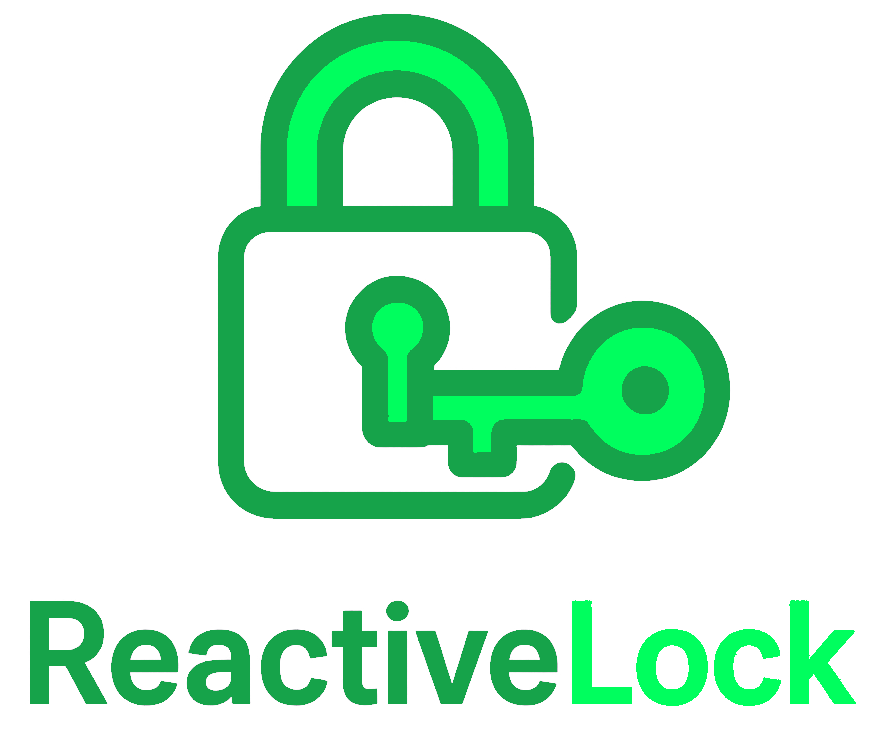
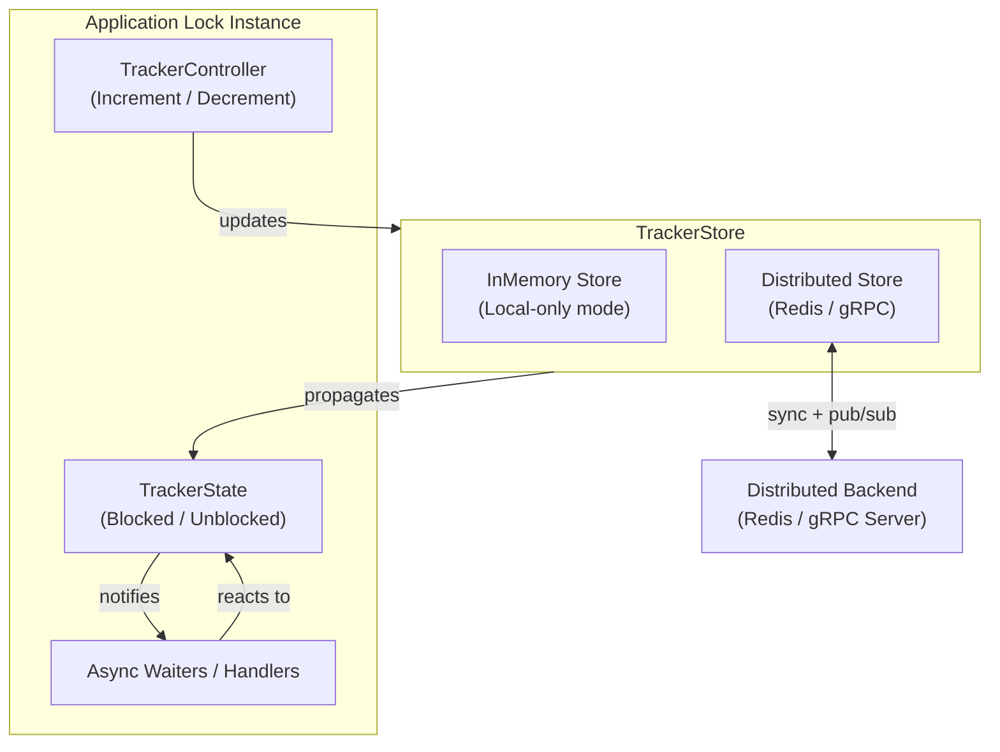

# ReactiveLock

<p align="center">
  
</p>

ReactiveLock is a .NET 8/9+ library for reactive, distributed lock coordination. It allows multiple application instances to track busy/idle state and react to changes using async handlers.

It supports both in-process and distributed synchronization. Redis is the stable distributed backend.

[](https://github.com/micheloliveira-com/ReactiveLock/actions/workflows/sonarqube.yml)

[](https://sonarcloud.io/summary/new_code?id=micheloliveira-com_ReactiveLock)

[](https://sonarcloud.io/summary/new_code?id=micheloliveira-com_ReactiveLock)

[](https://sonarcloud.io/dashboard?id=micheloliveira-com_ReactiveLock)
[](https://sonarcloud.io/dashboard?id=micheloliveira-com_ReactiveLock)
[](https://sonarcloud.io/dashboard?id=micheloliveira-com_ReactiveLock)
[](https://sonarcloud.io/dashboard?id=micheloliveira-com_ReactiveLock)
[](https://sonarcloud.io/dashboard?id=micheloliveira-com_ReactiveLock)
[](https://sonarcloud.io/dashboard?id=micheloliveira-com_ReactiveLock)
[](https://sonarcloud.io/dashboard?id=micheloliveira-com_ReactiveLock)
[](https://sonarcloud.io/dashboard?id=micheloliveira-com_ReactiveLock)
[](https://sonarcloud.io/dashboard?id=micheloliveira-com_ReactiveLock)
[](https://sonarcloud.io/dashboard?id=micheloliveira-com_ReactiveLock)
[](https://sonarcloud.io/dashboard?id=micheloliveira-com_ReactiveLock)

## Packages

| Badges                                                                                                        | Package Name                                    | Description                                               |
|---------------------------------------------------------------------------------------------------------------|------------------------------------------------|-----------------------------------------------------------|
| [](https://www.nuget.org/packages/ReactiveLock.Core) [](https://www.nuget.org/packages/ReactiveLock.Core) | **[ReactiveLock.Core](https://www.nuget.org/packages/ReactiveLock.Core)**                | Core abstractions and in-process lock coordination        |
| [](https://www.nuget.org/packages/ReactiveLock.DependencyInjection) [](https://www.nuget.org/packages/ReactiveLock.DependencyInjection) | **[ReactiveLock.DependencyInjection](https://www.nuget.org/packages/ReactiveLock.DependencyInjection)** | Adds DI and named resolution for distributed backends     |
| [](https://www.nuget.org/packages/ReactiveLock.Distributed.Redis) [](https://www.nuget.org/packages/ReactiveLock.Distributed.Redis) | **[ReactiveLock.Distributed.Redis](https://www.nuget.org/packages/ReactiveLock.Distributed.Redis)**     | Redis-based distributed lock synchronization              |
| [](https://www.nuget.org/packages/ReactiveLock.Distributed.Grpc) [](https://www.nuget.org/packages/ReactiveLock.Distributed.Grpc) | **[ReactiveLock.Distributed.Grpc](https://www.nuget.org/packages/ReactiveLock.Distributed.Grpc)**     | Grpc-based distributed lock synchronization              |

> Use only ReactiveLock.Core if you don't need distributed coordination.

## How ReactiveLock Differs from Other Locking Libraries

While many libraries solve similar lock problems, they differ in **how locks are handled**.  

ReactiveLock is strongly **event-driven**, minimizing overhead by first managing lock state **in memory** before resolving it across distributed instances. Most other libraries, prioritize **strict consistency**, performing active backend calls (e.g., Redis) for every lock operation. This approach ensures precise locks but can significantly affect performance, especially in high-intensity workloads where locks may be acquired thousands of times per second.  

ReactiveLock is designed to balance **reactive responsiveness** with distributed coordination, making it well-suited for scenarios where high throughput and near real-time state awareness are critical.

### Origin and Credit

**ReactiveLock** was created as a practical solution for high-intensity lock coordination during a **Brazilian 2025 Backend competition**. This event was designed to test **performance, consistency, and scalability** under near real-world conditions. It draws on lessons learned from these tests and from **Michel Oliveira**, a **Microsoft Specialist Software Architect** with over **10 years of experience** in building high-throughput distributed systems. With this library, was possible to achieve even high scores and a notable ranking in the competition.

Special credit goes to [**Francisco Zanfranceschi**](https://github.com/zanfranceschi/), the creator of the competition, for designing a framework that encourages **creative, high-performance software solutions**, with contents of [test/integration/k6-environment](https://github.com/micheloliveira-com/ReactiveLock/tree/main/test/integration/k6-environment) based on tests from this competition.

### Integration Testing

ReactiveLock integration tests are performed using the **competition K6 scripts**, simulating a **chaotic environment** with multiple lock behaviors. The tests generate **over 1 million HTTP requests with replays**, validating that ReactiveLock maintains **correct lock coordination, reactive updates, and distributed consistency** under high-intensity, near real-world workloads.

These tests run in a **constrained environment** limited to **350 MB of RAM** and **1.5 CPU**, demonstrating ReactiveLock's **efficiency and reliability under tight resource conditions**.

## Installation

In-process only:

```bash
dotnet add package ReactiveLock.Core
```

Distributed with Redis:
```bash
dotnet add package ReactiveLock.Core
dotnet add package ReactiveLock.DependencyInjection
dotnet add package ReactiveLock.Distributed.Redis
```

Distributed with Grpc:
```bash
dotnet add package ReactiveLock.Core
dotnet add package ReactiveLock.DependencyInjection
dotnet add package ReactiveLock.Distributed.Grpc
```

### Components Overview

- **TrackerController**  
  Manages lock operations using **reference counting**:  
  - `IncrementAsync()` increases the lock counter, **marking the state as blocked**. Each increment represents a “unit of work” that requires the lock.  
    - If a **`busyThreshold`** is defined, the lock state is only considered fully blocked once the counter reaches this threshold. This allows temporary or small increments to occur without immediately triggering a blocked state.  
  - `DecrementAsync()` decreases the lock counter, and when the counter reaches zero (or drops below the threshold), the state is **considered unblocked**, releasing the lock.  
  This approach allows multiple concurrent operations to safely share a single logical lock, and gives flexibility to **treat the lock as busy only after a configurable number of increments**.

- **TrackerState**  
  Holds the current lock state (blocked/unblocked) and notifies async waiters via `WaitIfBlockedAsync()`. State changes are first applied in memory, then optionally synced to a distributed store in multi-instance setups.

- **TrackerStore**  
  Persists the lock state locally (InMemory) or in a distributed backend (Redis / gRPC) and propagates updates to other instances for coordination.

- **Async Waiters**  
  Tasks or handlers that automatically react to state changes. They can pause when the lock is blocked and resume once it becomes unblocked.

## Core architecture

ReactiveLock is designed with an **in-memory-first awareness model**, actual lock control depends on the configured mode:

- In **local-only mode**, all lock transitions (`IncrementAsync`, `DecrementAsync`, etc.) are performed entirely in memory, with no external calls.
- In **distributed mode**, lock transitions are **resolved through the distributed backend** (such as Redis / Grpc), and only then is the local state updated. This ensures consistent coordination across all instances.

This design enables responsive, high-performance event-driven behavior while supporting multi-instance environments through external synchronization.

### Flow Summary

1. Controller modifies the state (`IncrementAsync` / `DecrementAsync`).
2. State updates are stored in TrackerStore.
3. Async waiters are notified when the lock transitions to unblocked.
4. In distributed mode, updates propagate to all instances via Redis or gRPC.

### Consistency and Usage Considerations

1. It is designed for **reactive and near real-time lock coordination, propagation, and notification**.
2. It offers a **practical alternative to traditional eventual consistency**, supporting **preemptive orchestration** of processes before critical events.
3. It can be understood as a **tool for mitigating CAP theorem trade-offs** in distributed applications. While no system can guarantee strong **Consistency**, full **Availability**, and perfect **Partition Tolerance** simultaneously, ReactiveLock balances these concerns by combining **in-memory-first responsiveness** with **distributed eventual convergence**. This allows applications to remain responsive during transient failures or partitions, while ensuring lock states eventually converge through retries, expirations, and recovery mechanisms.
4. Lock propagation delays may occur due to workload, thread pool pressure, or (in distributed mode) Redis / Grpc latency.
5. For workloads requiring strong consistency, ReactiveLock should be **combined with transactional layers** or **used as a complementary coordination mechanism**, not as the sole source of truth.

#### Distributed failure and contention mitigation

The distributed reactive lock system relies on **two categories of resiliency controls**:

1. **Polly `IAsyncPolicy`**  
   - Allows retry, circuit breaker, fallback, and timeout strategies to be applied whenever a persistence or replication operation fails.  
   - If `customAsyncStorePolicy` is not provided, a default retry policy with exponential backoff is applied.  
   - This ensures transient distributed failures (e.g., network partitions, node restarts, temporary store unavailability) do not immediately cause lock loss or false unlocks.

2. **TimeSpan parameters (`resiliencyParameters`)**  
   These control self-healing and recovery behavior:
   - **`instanceRenewalPeriodTimeSpan`** – Defines how often an instance refreshes its state in the replication store.  
     *Shorter intervals increase consistency but generate more background activity.*  
   - **`instanceExpirationPeriodTimeSpan`** – Defines how long an instance entry remains valid without renewal.  
     *If missed, the instance is considered stale and its lock state is discarded.*  
   - **`instanceRecoverPeriodTimeSpan`** – Defines the interval between retries when persistence or replication fails.  
     *Ensures eventual consistency even under sustained failure conditions.*

Together, these mechanisms ensure that:
- **Transient distributed failures** do not cause permanent divergence.  
- **Contention** is managed fairly across nodes.  
- **Recovery** happens automatically, keeping the distributed lock state convergent across connected instances.

Given this, you can observe:
#### Architecture Diagram


## Usage

### Simpler approach – Local-only (in-process)
Use this when you want a lightweight, in-memory, thread-coordinated lock mechanism within a single process.
```csharp
using MichelOliveira.Com.ReactiveLock.Core;

// Create a new tracker state instance
var state = new ReactiveLockTrackerState();

// Set the local state as blocked (simulates a lock being held)
await state.SetLocalStateBlockedAsync();

// Start 3 tasks that will each wait for the state to become unblocked
var tasks = Enumerable.Range(1, 3).Select(i =>
    Task.Run(async () => {
        Console.WriteLine($"[Task {i}] Waiting...");

        // Each task will wait here until the state becomes unblocked
        await state.WaitIfBlockedAsync();

        // Once unblocked, this message will print
        Console.WriteLine($"[Task {i}] Proceeded.");
    })
).ToArray();

// Simulate a delay before unblocking the state
await Task.Delay(1000);

// Unblock the state (releases all waiting tasks)
await state.SetLocalStateUnblockedAsync();

// Wait for all tasks to complete
await Task.WhenAll(tasks);

// Indicate completion
Console.WriteLine("Done.");

```

### Controller-based (Increment / Decrement) local-only sample
Use this when you prefer reference-counted control using a controller abstraction (IncrementAsync / DecrementAsync), ideal for more complex coordination.
```csharp
using MichelOliveira.Com.ReactiveLock.Core;
using System;
using System.Linq;
using System.Threading.Tasks;

var state = new ReactiveLockTrackerState();
var store = new InMemoryReactiveLockTrackerStore(state);
var controller = new ReactiveLockTrackerController(store);

// Initially block the state by incrementing (e.g. lock acquired)
await controller.IncrementAsync(); // Blocked

var tasks = Enumerable.Range(1, 3).Select(i =>
    Task.Run(async () =>
    {
        Console.WriteLine($"[Task {i}] Waiting...");
        await state.WaitIfBlockedAsync(); // Wait while blocked
        Console.WriteLine($"[Task {i}] Proceeded.");
    })
).ToArray();

// Simulate some delay before unblocking
await Task.Delay(1000);

// Decrement to unblock (lock released)
await controller.DecrementAsync(); // Unblocked

await Task.WhenAll(tasks);

Console.WriteLine("Done.");
```

### Expected Output (both examples)
```
[Task 3] Waiting...
[Task 1] Waiting...
[Task 2] Waiting...
[Task 3] Proceeded.
[Task 2] Proceeded.
[Task 1] Proceeded.
```

## Distributed HTTP Client Request Counter (Redis)

### Setup for Redis

```csharp
builder.Services.InitializeDistributedRedisReactiveLock(Dns.GetHostName());
builder.Services.AddDistributedRedisReactiveLock("http");
builder.Services.AddTransient<CountingHandler>();

builder.Services.AddHttpClient("http", client =>
    client.BaseAddress = new Uri(builder.Configuration.GetConnectionString("http")!))
    .AddHttpMessageHandler<CountingHandler>();

var app = builder.Build();
await app.UseDistributedRedisReactiveLockAsync();
```

### CountingHandler (Redis and / or Grpc)

```csharp
public class CountingHandler : DelegatingHandler
{
    private readonly IReactiveLockTrackerController _controller;

    public CountingHandler(IReactiveLockTrackerFactory factory)
    {
        _controller = factory.GetTrackerController("http");
    }

    protected override async Task<HttpResponseMessage> SendAsync(
        HttpRequestMessage request, CancellationToken cancellationToken)
    {
        await _controller.IncrementAsync();
        try
        {
            return await base.SendAsync(request, cancellationToken);
        }
        finally
        {
            await _controller.DecrementAsync();
        }
    }
}
```

### Expected Behavior

- Each HTTP request increments the "http" lock counter.
- On response, the counter is decremented.
- Lock state is shared across all application instances.
- You can use the lock state to:
  - Check if any requests are active.
  - Wait for all requests to complete.

### Use Case Example (Redis and / or Grpc)

```csharp
var state = factory.GetTrackerState("http");

if (await state.IsBlockedAsync())
{
    Console.WriteLine("HTTP requests active.");
}

await state.WaitIfBlockedAsync();
Console.WriteLine("No active HTTP requests.");
```

## Thread Safety and Lock Integrity

All calls to `ReactiveLockTrackerState` and `ReactiveLockTrackerController` are **thread-safe**.

However, **you are responsible for maintaining lock integrity** across your application logic. This means:

- If you call `IncrementAsync()` / `DecrementAsync()` (or `SetLocalStateBlockedAsync()` / `SetLocalStateUnblockedAsync()`) out of order, prematurely, or inconsistently, it **may result in an inaccurate lock state**.
- In distributed scenarios, **this inconsistency will propagate to all other instances**, leading to **incorrect coordination behavior** across your application cluster.

To maintain proper lock semantics:

- Always match every `IncrementAsync()` with a corresponding `DecrementAsync()`.
- Do not bypass controller logic if using `TrackerController`; use `SetLocalStateBlockedAsync()` / `SetLocalStateUnblockedAsync()` only for direct state control when you fully understand its implications.
- Treat lock transitions as critical sections in your own logic and enforce deterministic, exception-safe usage patterns (e.g. `try/finally` blocks).

> ReactiveLock provides safety mechanisms, but **you must ensure correctness of your lock protocol**.

## gRPC Usage Example

This example demonstrates setting up a .NET 10 WebApplication with **gRPC-based ReactiveLock** and registering trackers for distributed coordination in memory.

> **Note:** To use this example, you must have a running gRPC backend that the ReactiveLock clients can connect to. Without a backend, the trackers will not synchronize across instances. 

> The backend can also store lock state in another persistent location, such as a database, to maintain state beyond in-memory coordination.  

> Multiple backends can be configured for replication, allowing lock state to be synchronized across more than one backend for redundancy and high availability.

### Setup for Grpc
```csharp
using MichelOliveira.Com.ReactiveLock.Core;
using MichelOliveira.Com.ReactiveLock.DependencyInjection;
using MichelOliveira.Com.ReactiveLock.Distributed.Grpc;

var grpcReady = false;
var builder = WebApplication.CreateSlimBuilder(args);

// Configure Kestrel for HTTP/1 and HTTP/2
builder.WebHost.ConfigureKestrel(options =>
{
    options.ListenAnyIP(8081, listenOptions =>
        listenOptions.Protocols = Microsoft.AspNetCore.Server.Kestrel.Core.HttpProtocols.Http2);
    options.ListenAnyIP(8080, listenOptions =>
        listenOptions.Protocols = Microsoft.AspNetCore.Server.Kestrel.Core.HttpProtocols.Http1);
});

// Initialize distributed gRPC ReactiveLock with main and / or replica servers
builder.Services.InitializeDistributedGrpcReactiveLock(
    instanceName: Dns.GetHostName(),
    mainGrpcServer: builder.Configuration["rpc_local_server"],
    replicaGrpcServers: builder.Configuration["rpc_replica_server"]
);

// Register distributed trackers
builder.Services.AddDistributedGrpcReactiveLock("http");

// Register gRPC services
builder.Services.AddGrpc();
builder.Services.AddSingleton<ReactiveLockGrpcService>();

var app = builder.Build();


app.Use(async (context, next) =>
{
    if (context.Connection.LocalPort == 8080)
    {
        if (!grpcReady)
        {
            context.Response.StatusCode = StatusCodes.Status503ServiceUnavailable;
            return;
        }
    }

    await next();
});
// Map gRPC services
app.MapGrpcService<ReactiveLockGrpcService>();

// Wait until distributed ReactiveLock is ready before serving requests
_ = Task.Run(async () =>
{
    await app.UseDistributedGrpcReactiveLockAsync();
    grpcReady = true;
});

app.Run();

```
### ReactiveLockGrpcService
```csharp
using System.Collections.Concurrent;
using Grpc.Core;
using Google.Protobuf.WellKnownTypes;
using ReactiveLock.Distributed.Grpc;


public class ReactiveLockGrpcService : ReactiveLockGrpc.ReactiveLockGrpcBase
{
    private ConcurrentDictionary<string, LockGroup> Groups { get; } = [];
    public override async Task<Empty> SetStatus(LockStatusRequest request, ServerCallContext context)
    {
        var group = Groups.GetOrAdd(request.LockKey, _ => new LockGroup());
        group.InstanceStates[request.InstanceId] =
                new InstanceLockStatus()
                {
                    IsBusy = request.IsBusy,
                    LockData = request.LockData,
                    ValidUntil = request.ValidUntil
                };
        await BroadcastAsync(request.LockKey, group);
        return new Empty();
    }

    public override async Task SubscribeLockStatus(IAsyncStreamReader<LockStatusRequest> requestStream,
                                                   IServerStreamWriter<LockStatusNotification> responseStream,
                                                   ServerCallContext context)
    {
        await foreach (var req in requestStream.ReadAllAsync(context.CancellationToken).ConfigureAwait(false))
        {
            var group = Groups.GetOrAdd(req.LockKey, _ => new LockGroup());
            group.Subscribers.Add(new Subscriber(responseStream, requestStream));

            await responseStream.WriteAsync(new LockStatusNotification
            {
                LockKey = req.LockKey,
                InstancesStatus = { group.InstanceStates }
            }).ConfigureAwait(false);

            break;
        }
        await Task.Delay(Timeout.Infinite, context.CancellationToken).ConfigureAwait(false);
    }

    private async Task BroadcastAsync(string lockKey, LockGroup group)
    {
        var notification = new LockStatusNotification
        {
            LockKey = lockKey,
            InstancesStatus = { group.InstanceStates }
        };

        foreach (var subscriber in group.Subscribers.ToArray())
        {
            try
            {
                await subscriber.ResponseStream.WriteAsync(notification).ConfigureAwait(false);
            }
            catch
            {
                group.Subscribers.TryTake(out _);
            }
        }
    }
}
```

**Key Points:**

- `InitializeDistributedGrpcReactiveLock` sets up the ReactiveLock client/server connections.  
- Each tracker (`AddDistributedGrpcReactiveLock`) represents a lockable resource or counter.  
- `UseDistributedGrpcReactiveLockAsync` starts background synchronization with other instances.  
- `ReactiveLockGrpcService` handles the gRPC messages for distributed coordination.  

> This approach ensures multiple app instances coordinate lock states in real-time using gRPC streams.
> **Note:** The same `CountingHandler` shown in the previous example can be reused here.

## Requirements

- .NET 8/9+

## License

MIT © Michel Oliveira
