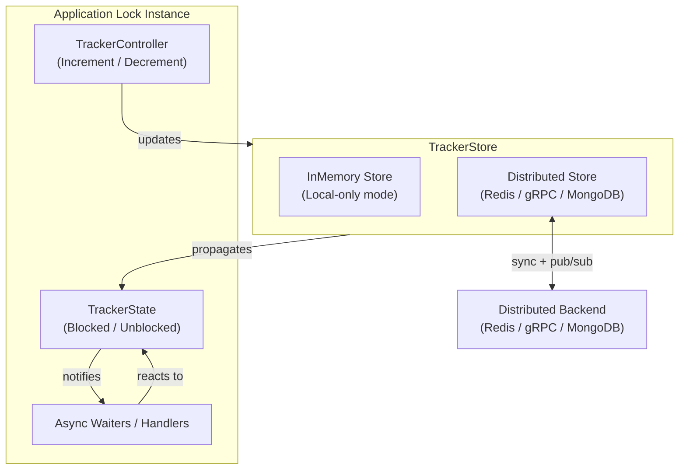

# ReactiveLock

<p align="center">
  
</p>

ReactiveLock is a .NET 8/9+ library for reactive, distributed lock coordination. It allows multiple application instances to track busy/idle state and react to changes using async handlers.

It supports both in-process and distributed synchronization through Redis, gRPC, and MongoDB backends.

[](https://github.com/micheloliveira-com/ReactiveLock/actions/workflows/sonarqube.yml)

[](https://sonarcloud.io/summary/new_code?id=micheloliveira-com_ReactiveLock)

[](https://sonarcloud.io/summary/new_code?id=micheloliveira-com_ReactiveLock)

[](https://sonarcloud.io/dashboard?id=micheloliveira-com_ReactiveLock)
[](https://sonarcloud.io/dashboard?id=micheloliveira-com_ReactiveLock)
[](https://sonarcloud.io/dashboard?id=micheloliveira-com_ReactiveLock)
[](https://sonarcloud.io/dashboard?id=micheloliveira-com_ReactiveLock)
[](https://sonarcloud.io/dashboard?id=micheloliveira-com_ReactiveLock)
[](https://sonarcloud.io/dashboard?id=micheloliveira-com_ReactiveLock)
[](https://sonarcloud.io/dashboard?id=micheloliveira-com_ReactiveLock)
[](https://sonarcloud.io/dashboard?id=micheloliveira-com_ReactiveLock)
[](https://sonarcloud.io/dashboard?id=micheloliveira-com_ReactiveLock)
[](https://sonarcloud.io/dashboard?id=micheloliveira-com_ReactiveLock)
[](https://sonarcloud.io/dashboard?id=micheloliveira-com_ReactiveLock)

## Packages

| Badges                                                                                                        | Package Name                                    | Description                                               |
|---------------------------------------------------------------------------------------------------------------|------------------------------------------------|-----------------------------------------------------------|
| [](https://www.nuget.org/packages/ReactiveLock.Core) [](https://www.nuget.org/packages/ReactiveLock.Core) | **[ReactiveLock.Core](https://www.nuget.org/packages/ReactiveLock.Core)**                | Core abstractions and in-process lock coordination        |
| [](https://www.nuget.org/packages/ReactiveLock.DependencyInjection) [](https://www.nuget.org/packages/ReactiveLock.DependencyInjection) | **[ReactiveLock.DependencyInjection](https://www.nuget.org/packages/ReactiveLock.DependencyInjection)** | Adds DI and named resolution for distributed backends     |
| [](https://www.nuget.org/packages/ReactiveLock.Distributed.Redis) [](https://www.nuget.org/packages/ReactiveLock.Distributed.Redis) | **[ReactiveLock.Distributed.Redis](https://www.nuget.org/packages/ReactiveLock.Distributed.Redis)**     | Redis-based distributed lock synchronization              |
| [](https://www.nuget.org/packages/ReactiveLock.Distributed.Grpc) [](https://www.nuget.org/packages/ReactiveLock.Distributed.Grpc) | **[ReactiveLock.Distributed.Grpc](https://www.nuget.org/packages/ReactiveLock.Distributed.Grpc)**     | Grpc-based distributed lock synchronization              |
| [](https://www.nuget.org/packages/ReactiveLock.Distributed.MongoDB) [](https://www.nuget.org/packages/ReactiveLock.Distributed.MongoDB) | **[ReactiveLock.Distributed.MongoDB](https://www.nuget.org/packages/ReactiveLock.Distributed.MongoDB)** | MongoDB lease documents and change-stream synchronization |

> Use only ReactiveLock.Core if you don't need distributed coordination.

## How ReactiveLock Differs from Other Locking Libraries

While many libraries solve similar lock problems, they differ in **how locks are handled**.  

ReactiveLock is strongly **event-driven**, minimizing overhead by first managing lock state **in memory** before resolving it across distributed instances. Most other libraries, prioritize **strict consistency**, performing active backend calls (e.g., Redis) for every lock operation. This approach ensures precise locks but can significantly affect performance, especially in high-intensity workloads where locks may be acquired thousands of times per second.  

ReactiveLock is designed to balance **reactive responsiveness** with distributed coordination, making it well-suited for scenarios where high throughput and near real-time state awareness are critical.

### Origin and Credit

**ReactiveLock** was created as a practical solution for high-intensity lock coordination during a **Brazilian 2025 Backend competition**. This event was designed to test **performance, consistency, and scalability** under near real-world conditions. It draws on lessons learned from these tests and from **Michel Oliveira**, a **Microsoft Specialist Software Architect** with over **10 years of experience** in building high-throughput distributed systems. With this library, was possible to achieve even high scores and a notable ranking in the competition.

Special credit goes to [**Francisco Zanfranceschi**](https://github.com/zanfranceschi/), the creator of the competition, for designing a framework that encourages **creative, high-performance software solutions**, with contents of [test/integration/k6-environment](https://github.com/micheloliveira-com/ReactiveLock/tree/main/test/integration/k6-environment) based on tests from this competition.

### Integration Testing

ReactiveLock integration tests are performed using the **competition K6 scripts**, simulating a **chaotic environment** with multiple lock behaviors. The tests generate **over 1 million HTTP requests with replays**, validating that ReactiveLock maintains **correct lock coordination, reactive updates, and distributed consistency** under high-intensity, near real-world workloads.

These tests run in a **constrained environment** limited to **350 MB of RAM** and **1.5 CPU**, demonstrating ReactiveLock's **efficiency and reliability under tight resource conditions**.

## Installation

In-process only:

```bash
dotnet add package ReactiveLock.Core
```

Distributed with Redis:
```bash
dotnet add package ReactiveLock.Core
dotnet add package ReactiveLock.DependencyInjection
dotnet add package ReactiveLock.Distributed.Redis
```

Distributed with Grpc:
```bash
dotnet add package ReactiveLock.Core
dotnet add package ReactiveLock.DependencyInjection
dotnet add package ReactiveLock.Distributed.Grpc
```

Distributed with MongoDB:

```bash
dotnet add package ReactiveLock.Core
dotnet add package ReactiveLock.DependencyInjection
dotnet add package ReactiveLock.Distributed.MongoDB
```

### Components Overview

- **TrackerController**  
  Manages lock operations using **reference counting**:  
  - `IncrementAsync()` increases the lock counter, **marking the state as blocked**. Each increment represents a “unit of work” that requires the lock.  
    - If a **`busyThreshold`** is defined, the lock state is only considered fully blocked once the counter reaches this threshold. This allows temporary or small increments to occur without immediately triggering a blocked state.  
  - `DecrementAsync()` decreases the lock counter, and when the counter reaches zero (or drops below the threshold), the state is **considered unblocked**, releasing the lock.  
  This approach allows multiple concurrent operations to safely share a single logical lock, and gives flexibility to **treat the lock as busy only after a configurable number of increments**.

- **TrackerState**  
  Holds the current lock state (blocked/unblocked) and notifies async waiters via `WaitIfBlockedAsync()`. State changes are first applied in memory, then optionally synced to a distributed store in multi-instance setups.

- **TrackerStore**  
  Persists the lock state locally (InMemory) or in a distributed backend (Redis / gRPC / MongoDB) and propagates updates to other instances for coordination.

- **Async Waiters**  
  Tasks or handlers that automatically react to state changes. They can pause when the lock is blocked and resume once it becomes unblocked.

## Core architecture

ReactiveLock is designed with an **in-memory-first awareness model**, actual lock control depends on the configured mode:

- In **local-only mode**, all lock transitions (`IncrementAsync`, `DecrementAsync`, etc.) are performed entirely in memory, with no external calls.
- In **distributed mode**, lock transitions are **resolved through the distributed backend** (such as Redis / gRPC / MongoDB), and only then is the local state updated. This ensures consistent coordination across all instances.

This design enables responsive, high-performance event-driven behavior while supporting multi-instance environments through external synchronization.

### Flow Summary

1. Controller modifies the state (`IncrementAsync` / `DecrementAsync`).
2. State updates are stored in TrackerStore.
3. Async waiters are notified when the lock transitions to unblocked.
4. In distributed mode, updates propagate to all instances via Redis, gRPC, or MongoDB change streams.

### Consistency and Usage Considerations

1. It is designed for **reactive and near real-time lock coordination, propagation, and notification**.
2. It offers a **practical alternative to traditional eventual consistency**, supporting **preemptive orchestration** of processes before critical events.
3. It can be understood as a **tool for mitigating CAP theorem trade-offs** in distributed applications. While no system can guarantee strong **Consistency**, full **Availability**, and perfect **Partition Tolerance** simultaneously, ReactiveLock balances these concerns by combining **in-memory-first responsiveness** with **distributed eventual convergence**. This allows applications to remain responsive during transient failures or partitions, while ensuring lock states eventually converge through retries, expirations, and recovery mechanisms.
4. Lock propagation delays may occur due to workload, thread pool pressure, or distributed-backend latency.
5. For workloads requiring strong consistency, ReactiveLock should be **combined with transactional layers** or **used as a complementary coordination mechanism**, not as the sole source of truth.

#### Distributed failure and contention mitigation

The distributed reactive lock system relies on **two categories of resiliency controls**:

1. **Polly `IAsyncPolicy`**  
   - Allows retry, circuit breaker, fallback, and timeout strategies to be applied whenever a persistence or replication operation fails.  
   - If `customAsyncStorePolicy` is not provided, a default retry policy with exponential backoff is applied.  
   - This ensures transient distributed failures (e.g., network partitions, node restarts, temporary store unavailability) do not immediately cause lock loss or false unlocks.

2. **TimeSpan parameters (`resiliencyParameters`)**  
   These control self-healing and recovery behavior:
   - **`instanceRenewalPeriodTimeSpan`** – Defines how often an instance refreshes its state in the replication store.  
     *Shorter intervals increase consistency but generate more background activity.*  
   - **`instanceExpirationPeriodTimeSpan`** – Defines how long an instance entry remains valid without renewal.  
     *If missed, the instance is considered stale and its lock state is discarded.*  
   - **`instanceRecoverPeriodTimeSpan`** – Defines the interval between retries when persistence or replication fails.  
     *Ensures eventual consistency even under sustained failure conditions.*

Together, these mechanisms ensure that:
- **Transient distributed failures** do not cause permanent divergence.  
- **Contention** is managed fairly across nodes.  
- **Recovery** happens automatically, keeping the distributed lock state convergent across connected instances.

Given this, you can observe:
#### Architecture Diagram

```mermaid
flowchart TD
    subgraph App["Application Lock Instance"]
        Controller["TrackerController<br/>(Increment / Decrement)"]
        State["TrackerState<br/>(Blocked / Unblocked)"]
        Waiters["Async Waiters / Handlers"]
    end

    subgraph Stores["TrackerStore"]
        Local["InMemory Store<br/>(Local-only mode)"]
        Dist["Distributed Store<br/>(Redis / gRPC / MongoDB)"]
    end

    Backend["Distributed Backend<br/>(Redis / gRPC / MongoDB)"]

    Controller -->|updates| Stores
    Stores -->|propagates| State
    State -->|notifies| Waiters
    Waiters -->|reacts to| State

    Dist <-->|sync + pub/sub| Backend
```

## Usage

### Simpler approach – Local-only (in-process)
Use this when you want a lightweight, in-memory, thread-coordinated lock mechanism within a single process.
```csharp
using MichelOliveira.Com.ReactiveLock.Core;

// Create a new tracker state instance
var state = new ReactiveLockTrackerState();

// Set the local state as blocked (simulates a lock being held)
await state.SetLocalStateBlockedAsync();

// Start 3 tasks that will each wait for the state to become unblocked
var tasks = Enumerable.Range(1, 3).Select(i =>
    Task.Run(async () => {
        Console.WriteLine($"[Task {i}] Waiting...");

        // Each task will wait here until the state becomes unblocked
        await state.WaitIfBlockedAsync();

        // Once unblocked, this message will print
        Console.WriteLine($"[Task {i}] Proceeded.");
    })
).ToArray();

// Simulate a delay before unblocking the state
await Task.Delay(1000);

// Unblock the state (releases all waiting tasks)
await state.SetLocalStateUnblockedAsync();

// Wait for all tasks to complete
await Task.WhenAll(tasks);

// Indicate completion
Console.WriteLine("Done.");

```

### Controller-based (Increment / Decrement) local-only sample
Use this when you prefer reference-counted control using a controller abstraction (IncrementAsync / DecrementAsync), ideal for more complex coordination.
```csharp
using MichelOliveira.Com.ReactiveLock.Core;
using System;
using System.Linq;
using System.Threading.Tasks;

var state = new ReactiveLockTrackerState();
var store = new InMemoryReactiveLockTrackerStore(state);
var controller = new ReactiveLockTrackerController(store);

// Initially block the state by incrementing (e.g. lock acquired)
await controller.IncrementAsync(); // Blocked

var tasks = Enumerable.Range(1, 3).Select(i =>
    Task.Run(async () =>
    {
        Console.WriteLine($"[Task {i}] Waiting...");
        await state.WaitIfBlockedAsync(); // Wait while blocked
        Console.WriteLine($"[Task {i}] Proceeded.");
    })
).ToArray();

// Simulate some delay before unblocking
await Task.Delay(1000);

// Decrement to unblock (lock released)
await controller.DecrementAsync(); // Unblocked

await Task.WhenAll(tasks);

Console.WriteLine("Done.");
```

### Expected Output (both examples)
```
[Task 3] Waiting...
[Task 1] Waiting...
[Task 2] Waiting...
[Task 3] Proceeded.
[Task 2] Proceeded.
[Task 1] Proceeded.
```

## Distributed backend setup and storage

### Redis

Redis is the authoritative store for distributed Redis lock state. Every
application instance must connect to the same Redis deployment so that they read
the same hashes and receive notifications from the same Pub/Sub channels.

Register an `IConnectionMultiplexer`, initialize the provider, add each lock used
by the application, and subscribe after building the application:

```csharp
using MichelOliveira.Com.ReactiveLock.Distributed.Redis;
using StackExchange.Redis;
using System.Net;

var builder = WebApplication.CreateSlimBuilder(args);

builder.Services.AddSingleton<IConnectionMultiplexer>(_ =>
    ConnectionMultiplexer.Connect(
        builder.Configuration.GetConnectionString("redis")!));

builder.Services.InitializeDistributedRedisReactiveLock(Dns.GetHostName());
builder.Services.AddDistributedRedisReactiveLock("http");

var app = builder.Build();
await app.UseDistributedRedisReactiveLockAsync();
```

For every logical lock, the provider uses one Redis hash and one Pub/Sub channel:

```text
Hash:    ReactiveLock:Redis:HashSet:{lockKey}
Channel: ReactiveLock:Redis:HashSetNotifier:{lockKey}
```

For a lock named `http`, the stored hash is equivalent to:

```text
Key: ReactiveLock:Redis:HashSet:http

Hash field       Hash value
backend-1        1;638931076500000000;optional-lock-data
backend-2        0;638931076500000000
```

Each hash field is an application instance:

| Part | Purpose |
|---|---|
| Hash field | Unique `instanceName` supplied to `InitializeDistributedRedisReactiveLock`. It must be stable and unique among simultaneously running instances. |
| First value segment | Busy flag: `1` means busy and `0` means idle. |
| Second value segment | Lease expiration represented as UTC ticks. |
| Third value segment | Optional lock data. It is separated from the other values by `;`. |

Status values are renewed periodically while the application is running. By
default, renewal occurs every 5 seconds, a value remains valid for 10 seconds,
and failed persistence is recovered every 15 seconds. These timings can be
overridden through the `resiliencyParameters` argument of
`AddDistributedRedisReactiveLock`.

The provider does not assign a Redis key expiration to the hash or automatically
delete stale hash fields. Instead, readers logically ignore busy entries whose
lease timestamp has expired. Consequently, an expired field can remain visible
in Redis while no longer affecting the distributed lock result.

On every state write, the provider performs an `HSET` and then publishes the
encoded state value to the lock's notifier channel. These are two sequential
Redis operations, not a Redis transaction. Subscribed application instances
react to the notification by reading the complete hash with `HGETALL`, discarding
expired entries, and updating their local reactive state. Redis Pub/Sub
notifications are transient; the renewable lease and subsequent state
notifications provide eventual recovery, while Redis remains the source queried
to resolve the current distributed state.

`RegisteredLocks` in the Redis provider is temporary, process-local startup
metadata. Its tuples contain the locally configured lock key, Redis hash name,
and Redis notifier channel name. The queue is drained during
`UseDistributedRedisReactiveLockAsync` and never contains the distributed
busy/idle values. Those values are stored in the Redis hashes described above.

The Redis account must be able to execute `HSET`, `HGETALL`, `PUBLISH`, and
`SUBSCRIBE` for the configured keys and channels. Redis durability, replication,
and failover behavior depend on the Redis deployment configuration and are not
enabled or changed by ReactiveLock.

### MongoDB

MongoDB is the authoritative store for distributed MongoDB lock state. Every
application instance must connect to the same MongoDB replica set or sharded
cluster because the provider uses MongoDB change streams to propagate lock
changes between instances. A standalone MongoDB server does not support this
synchronization mechanism.

Register an `IMongoClient`, initialize the provider, add each lock used by the
application, and start the change-stream listener after building the application:

```csharp
using MichelOliveira.Com.ReactiveLock.Distributed.MongoDB;
using MongoDB.Driver;
using System.Net;

var builder = WebApplication.CreateSlimBuilder(args);

builder.Services.AddSingleton<IMongoClient>(_ =>
    new MongoClient(builder.Configuration.GetConnectionString("mongodb")!));

builder.Services.InitializeDistributedMongoDbReactiveLock(
    instanceName: Dns.GetHostName(),
    databaseName: "ReactiveLock",
    collectionName: "LockStatus");

builder.Services.AddDistributedMongoDbReactiveLock("http");

var app = builder.Build();
await app.UseDistributedMongoDbReactiveLockAsync();
```

The default database is `ReactiveLock` and the default collection is
`LockStatus`. Both names can be changed in
`InitializeDistributedMongoDbReactiveLock`.

The collection contains one renewable document for each `(LockKey, InstanceId)`
pair. For example:

```javascript
{
  _id: "aHR0cA.YmFja2VuZC0x",
  LockKey: "http",
  InstanceId: "backend-1",
  IsBusy: true,
  LockData: null,
  ValidUntilUtc: ISODate("2026-09-10T21:27:30.000Z"),
  Revision: NumberLong("638931076500000001")
}
```

| Field | Purpose |
|---|---|
| `_id` | Deterministic ID composed of the Base64URL-encoded lock key and instance ID, separated by `.`. Upserts from one instance therefore replace only that instance's state for that lock. |
| `LockKey` | Logical lock name supplied to `AddDistributedMongoDbReactiveLock`. |
| `InstanceId` | Unique application-instance name supplied during initialization. It must be stable and unique among simultaneously running instances. |
| `IsBusy` | Whether this instance currently reports the lock as busy. |
| `LockData` | Optional application metadata associated with a busy lock. |
| `ValidUntilUtc` | UTC lease expiration. Expired documents are ignored even if MongoDB's TTL monitor has not deleted them yet. |
| `Revision` | Monotonically increasing revision generated by the application instance for its state updates. |

Status documents are renewed periodically while the application is running. By
default, renewal occurs every 5 seconds and a document remains valid for 10
seconds. Failed persistence is retried and recovered according to the configured
Polly policy and recovery period. These timings can be overridden through the
`resiliencyParameters` argument of `AddDistributedMongoDbReactiveLock`.

The provider creates these indexes automatically during
`UseDistributedMongoDbReactiveLockAsync`:

```javascript
// Finds the active busy instances for a logical lock.
{ LockKey: 1, IsBusy: 1, ValidUntilUtc: 1 }
// name: reactivelock_active_lookup

// Eventually removes expired lease documents.
{ ValidUntilUtc: 1 }
// name: reactivelock_expiration_ttl, expireAfterSeconds: 0
```

Writes use MongoDB majority write concern. After an upsert, MongoDB change
streams notify the other application instances; each receiving instance queries
the collection for non-expired busy documents and updates its local reactive
state.

`RegisteredLocks` in the provider is only temporary, process-local startup
metadata. It records which locally configured DI controllers must subscribe to
MongoDB and is discarded after initialization. It never contains busy/idle lock
state. All state used to coordinate different application instances is stored in
the MongoDB documents described above.

The MongoDB account needs permission to read and write the configured collection,
create its indexes, and open a change stream. Application instances must register
the lock keys they consume so their local controllers, handlers, and change-stream
dispatch can be initialized.

### gRPC

The gRPC provider defines a replication protocol; gRPC itself is not a database.
Application instances send their renewable lock state to one or more configured
gRPC servers, and those servers are responsible for storing the state and
broadcasting complete lock snapshots to subscribers.

Configure the server addresses, add each locally used lock, and start the
subscriptions after building the application:

```csharp
using MichelOliveira.Com.ReactiveLock.Distributed.Grpc;
using System.Net;

var builder = WebApplication.CreateSlimBuilder(args);

builder.Services.InitializeDistributedGrpcReactiveLock(
    Dns.GetHostName(),
    "http://reactivelock-grpc-1:8081",
    "http://reactivelock-grpc-2:8081");

builder.Services.AddDistributedGrpcReactiveLock("http");

var app = builder.Build();
await app.UseDistributedGrpcReactiveLockAsync();
```

The generated `ReactiveLockGrpc` service exposes two operations:

| RPC | Purpose |
|---|---|
| `SetStatus` | Unary call used by an application instance to send its current renewable lock state. |
| `SubscribeLockStatus` | Bidirectional stream. The client first sends the lock it consumes, then receives complete state snapshots from the server. |

`SetStatus` sends this logical structure to every configured gRPC server:

```text
LockStatusRequest
  LockKey:    "http"
  InstanceId: "backend-1"
  IsBusy:     true
  LockData:   "optional-lock-data"
  ValidUntil: 2026-09-10T21:27:30Z
```

Servers send subscribers a `LockStatusNotification` containing the lock key and
a map keyed by instance ID:

```text
LockStatusNotification
  LockKey: "http"
  InstancesStatus:
    "backend-1": { IsBusy: true,  LockData: "optional-lock-data", ValidUntil: ... }
    "backend-2": { IsBusy: false, LockData: null,                 ValidUntil: ... }
```

The client considers only entries where `IsBusy` is `true` and `ValidUntil` is
later than the current UTC time. Missing and expired entries do not block the
lock. Lock data from active busy instances is combined and passed to the local
reactive state.

Status is renewed every 5 seconds by default, remains valid for 10 seconds, and
failed replication is recovered every 15 seconds. These timings can be changed
with the `resiliencyParameters` argument of
`AddDistributedGrpcReactiveLock`. Store and subscription calls can use custom
Polly policies.

The package sends each update sequentially to every configured remote client and
opens a subscription for every `(server, lockKey)` pair. Each server must
implement the generated `ReactiveLockGrpcBase` contract and must publish a
complete per-lock instance map. Authentication, TLS, authorization, persistence,
server replication, cleanup of expired records, and conflict handling belong to
the server implementation.

The sample `ReactiveLockGrpcService` later in this README stores state in a
`ConcurrentDictionary`. That sample is process-local and non-durable. It is
suitable for demonstrating the protocol, but a production deployment with
multiple gRPC server instances needs an appropriately shared or replicated
server-side store.

`RegisteredLocks` and the configured remote-client list are temporary,
process-local startup metadata. They determine which local DI controllers and
gRPC streams must be initialized and are discarded after initialization. The
distributed busy/idle state is carried by the gRPC messages and stored according
to the server implementation.

## Thread Safety and Lock Integrity

All calls to `ReactiveLockTrackerState` and `ReactiveLockTrackerController` are **thread-safe**.

However, **you are responsible for maintaining lock integrity** across your application logic. This means:

- If you call `IncrementAsync()` / `DecrementAsync()` (or `SetLocalStateBlockedAsync()` / `SetLocalStateUnblockedAsync()`) out of order, prematurely, or inconsistently, it **may result in an inaccurate lock state**.
- In distributed scenarios, **this inconsistency will propagate to all other instances**, leading to **incorrect coordination behavior** across your application cluster.

To maintain proper lock semantics:

- Always match every `IncrementAsync()` with a corresponding `DecrementAsync()`.
- Do not bypass controller logic if using `TrackerController`; use `SetLocalStateBlockedAsync()` / `SetLocalStateUnblockedAsync()` only for direct state control when you fully understand its implications.
- Treat lock transitions as critical sections in your own logic and enforce deterministic, exception-safe usage patterns (e.g. `try/finally` blocks).

> ReactiveLock provides safety mechanisms, but **you must ensure correctness of your lock protocol**.

## Redis Usage Example: Distributed HTTP Client Request Counter

### Setup for Redis

```csharp
builder.Services.InitializeDistributedRedisReactiveLock(Dns.GetHostName());
builder.Services.AddDistributedRedisReactiveLock("http");
builder.Services.AddTransient<CountingHandler>();

builder.Services.AddHttpClient("http", client =>
    client.BaseAddress = new Uri(builder.Configuration.GetConnectionString("http")!))
    .AddHttpMessageHandler<CountingHandler>();

var app = builder.Build();
await app.UseDistributedRedisReactiveLockAsync();
```

### CountingHandler (Redis, MongoDB, or gRPC)

```csharp
public class CountingHandler : DelegatingHandler
{
    private readonly IReactiveLockTrackerController _controller;

    public CountingHandler(IReactiveLockTrackerFactory factory)
    {
        _controller = factory.GetTrackerController("http");
    }

    protected override async Task<HttpResponseMessage> SendAsync(
        HttpRequestMessage request, CancellationToken cancellationToken)
    {
        await _controller.IncrementAsync();
        try
        {
            return await base.SendAsync(request, cancellationToken);
        }
        finally
        {
            await _controller.DecrementAsync();
        }
    }
}
```

### Expected Behavior

- Each HTTP request increments the "http" lock counter.
- On response, the counter is decremented.
- Lock state is shared across all application instances.
- You can use the lock state to:
  - Check if any requests are active.
  - Wait for all requests to complete.

### Use Case Example (Redis, MongoDB, or gRPC)

```csharp
var state = factory.GetTrackerState("http");

if (await state.IsBlockedAsync())
{
    Console.WriteLine("HTTP requests active.");
}

await state.WaitIfBlockedAsync();
Console.WriteLine("No active HTTP requests.");
```

## MongoDB Usage Example: Distributed HTTP Client Request Counter

This example uses MongoDB to coordinate the `http` tracker across multiple
application instances. MongoDB must run as a replica set or sharded cluster so
the provider can consume change streams.

### MongoDB connection settings

```json
{
  "ConnectionStrings": {
    "mongodb": "mongodb://mongodb:27017/?replicaSet=rs0",
    "http": "https://example-service"
  }
}
```

All application instances must connect to the same MongoDB deployment. Each
instance must also use a unique, stable `instanceName`.

### Setup for MongoDB

```csharp
using MichelOliveira.Com.ReactiveLock.Core;
using MichelOliveira.Com.ReactiveLock.DependencyInjection;
using MichelOliveira.Com.ReactiveLock.Distributed.MongoDB;
using MongoDB.Driver;
using System.Net;

var builder = WebApplication.CreateSlimBuilder(args);

builder.Services.AddSingleton<IMongoClient>(_ =>
    new MongoClient(builder.Configuration.GetConnectionString("mongodb")!));

builder.Services.InitializeDistributedMongoDbReactiveLock(
    instanceName: Dns.GetHostName(),
    databaseName: "ReactiveLock",
    collectionName: "LockStatus");

builder.Services.AddDistributedMongoDbReactiveLock("http");
builder.Services.AddTransient<CountingHandler>();

builder.Services.AddHttpClient("http", client =>
    client.BaseAddress = new Uri(
        builder.Configuration.GetConnectionString("http")!))
    .AddHttpMessageHandler<CountingHandler>();

var app = builder.Build();

// Creates the indexes, opens the change stream, and waits until it is ready.
await app.UseDistributedMongoDbReactiveLockAsync();

app.Run();
```

Use the same `CountingHandler` shown in the Redis example. Every outgoing HTTP
request increments the local counter before it is sent and decrements it in the
`finally` block after completion. The resulting busy/idle lease is stored in
MongoDB and propagated to the other application instances through the change
stream.

### Reading the MongoDB-backed state

```csharp
var factory = app.Services.GetRequiredService<IReactiveLockTrackerFactory>();
var state = factory.GetTrackerState("http");

if (await state.IsBlockedAsync())
{
    Console.WriteLine("At least one application instance has HTTP requests active.");
}

await state.WaitIfBlockedAsync();
Console.WriteLine("No active HTTP requests across the application instances.");
```

The `ReactiveLock.LockStatus` collection can be inspected in `mongosh`:

```javascript
use ReactiveLock
db.LockStatus.find({ LockKey: "http" })
```

Expired documents can remain visible until MongoDB's TTL monitor deletes them,
but the provider immediately excludes them from active-lock queries based on
`ValidUntilUtc`.

## gRPC Usage Example

This example demonstrates setting up a .NET 10 WebApplication with **gRPC-based ReactiveLock** and registering trackers for distributed coordination in memory.

> **Note:** To use this example, you must have a running gRPC backend that the ReactiveLock clients can connect to. Without a backend, the trackers will not synchronize across instances. 

> The backend can also store lock state in another persistent location, such as a database, to maintain state beyond in-memory coordination.  

> Multiple backends can be configured for replication, allowing lock state to be synchronized across more than one backend for redundancy and high availability.

### Setup for Grpc
```csharp
using MichelOliveira.Com.ReactiveLock.Core;
using MichelOliveira.Com.ReactiveLock.DependencyInjection;
using MichelOliveira.Com.ReactiveLock.Distributed.Grpc;

var grpcReady = false;
var builder = WebApplication.CreateSlimBuilder(args);

// Configure Kestrel for HTTP/1 and HTTP/2
builder.WebHost.ConfigureKestrel(options =>
{
    options.ListenAnyIP(8081, listenOptions =>
        listenOptions.Protocols = Microsoft.AspNetCore.Server.Kestrel.Core.HttpProtocols.Http2);
    options.ListenAnyIP(8080, listenOptions =>
        listenOptions.Protocols = Microsoft.AspNetCore.Server.Kestrel.Core.HttpProtocols.Http1);
});

// Initialize distributed gRPC ReactiveLock with main and / or replica servers
builder.Services.InitializeDistributedGrpcReactiveLock(
    Dns.GetHostName(),
    builder.Configuration["rpc_local_server"]!,
    builder.Configuration["rpc_replica_server"]!);

// Register distributed trackers
builder.Services.AddDistributedGrpcReactiveLock("http");

// Register gRPC services
builder.Services.AddGrpc();
builder.Services.AddSingleton<ReactiveLockGrpcService>();

var app = builder.Build();


app.Use(async (context, next) =>
{
    if (context.Connection.LocalPort == 8080)
    {
        if (!grpcReady)
        {
            context.Response.StatusCode = StatusCodes.Status503ServiceUnavailable;
            return;
        }
    }

    await next();
});
// Map gRPC services
app.MapGrpcService<ReactiveLockGrpcService>();

// Wait until distributed ReactiveLock is ready before serving requests
_ = Task.Run(async () =>
{
    await app.UseDistributedGrpcReactiveLockAsync();
    grpcReady = true;
});

app.Run();

```
### ReactiveLockGrpcService
```csharp
using System.Collections.Concurrent;
using Grpc.Core;
using Google.Protobuf.WellKnownTypes;
using ReactiveLock.Distributed.Grpc;


public class ReactiveLockGrpcService : ReactiveLockGrpc.ReactiveLockGrpcBase
{
    private ConcurrentDictionary<string, LockGroup> Groups { get; } = [];
    public override async Task<Empty> SetStatus(LockStatusRequest request, ServerCallContext context)
    {
        var group = Groups.GetOrAdd(request.LockKey, _ => new LockGroup());
        group.InstanceStates[request.InstanceId] =
                new InstanceLockStatus()
                {
                    IsBusy = request.IsBusy,
                    LockData = request.LockData,
                    ValidUntil = request.ValidUntil
                };
        await BroadcastAsync(request.LockKey, group);
        return new Empty();
    }

    public override async Task SubscribeLockStatus(IAsyncStreamReader<LockStatusRequest> requestStream,
                                                   IServerStreamWriter<LockStatusNotification> responseStream,
                                                   ServerCallContext context)
    {
        await foreach (var req in requestStream.ReadAllAsync(context.CancellationToken).ConfigureAwait(false))
        {
            var group = Groups.GetOrAdd(req.LockKey, _ => new LockGroup());
            group.Subscribers.Add(new Subscriber(responseStream, requestStream));

            await responseStream.WriteAsync(new LockStatusNotification
            {
                LockKey = req.LockKey,
                InstancesStatus = { group.InstanceStates }
            }).ConfigureAwait(false);

            break;
        }
        await Task.Delay(Timeout.Infinite, context.CancellationToken).ConfigureAwait(false);
    }

    private async Task BroadcastAsync(string lockKey, LockGroup group)
    {
        var notification = new LockStatusNotification
        {
            LockKey = lockKey,
            InstancesStatus = { group.InstanceStates }
        };

        foreach (var subscriber in group.Subscribers.ToArray())
        {
            try
            {
                await subscriber.ResponseStream.WriteAsync(notification).ConfigureAwait(false);
            }
            catch
            {
                group.Subscribers.TryTake(out _);
            }
        }
    }
}
```

**Key Points:**

- `InitializeDistributedGrpcReactiveLock` sets up the ReactiveLock client/server connections.  
- Each tracker (`AddDistributedGrpcReactiveLock`) represents a lockable resource or counter.  
- `UseDistributedGrpcReactiveLockAsync` starts background synchronization with other instances.  
- `ReactiveLockGrpcService` handles the gRPC messages for distributed coordination.  

> This approach ensures multiple app instances coordinate lock states in real-time using gRPC streams.
> **Note:** The same `CountingHandler` shown in the previous example can be reused here.

## Requirements

- .NET 8/9+

## License

MIT © Michel Oliveira
