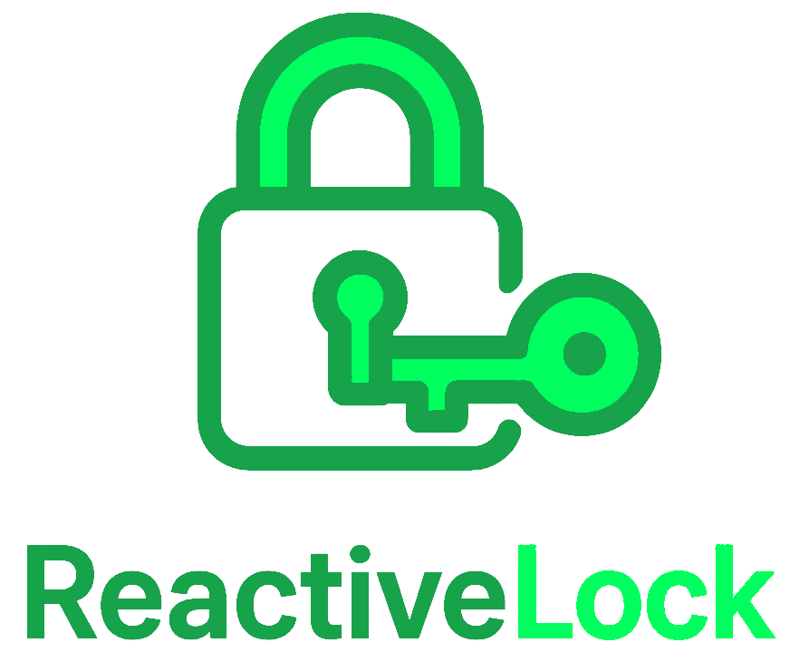
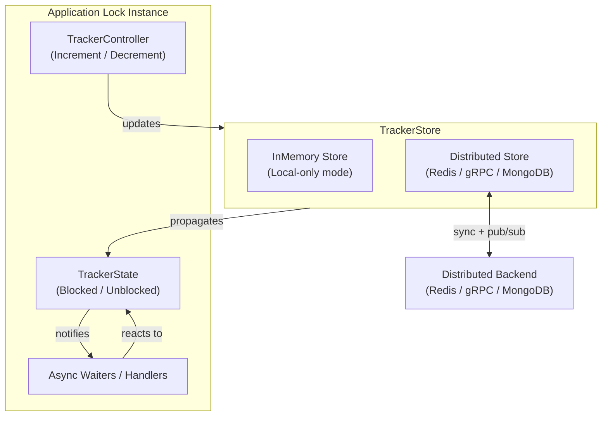

# ReactiveLock

<p align="center">
  
</p>

ReactiveLock is a .NET 8+ library for reactive, distributed lock coordination. It allows multiple application instances to track busy/idle state and react to changes using async handlers.

It supports both in-process and distributed synchronization through Redis, gRPC, and MongoDB backends.

[](https://sonarcloud.io/summary/new_code?id=micheloliveira-com_ReactiveLock)

[](https://github.com/micheloliveira-com/ReactiveLock/commits) [](https://github.com/micheloliveira-com/ReactiveLock/actions/workflows/sonarqube.yml)

[](https://sonarcloud.io/summary/new_code?id=micheloliveira-com_ReactiveLock)

[](https://sonarcloud.io/dashboard?id=micheloliveira-com_ReactiveLock)
[](https://sonarcloud.io/dashboard?id=micheloliveira-com_ReactiveLock)
[](https://sonarcloud.io/dashboard?id=micheloliveira-com_ReactiveLock)
[](https://sonarcloud.io/dashboard?id=micheloliveira-com_ReactiveLock)
[](https://sonarcloud.io/dashboard?id=micheloliveira-com_ReactiveLock)
[](https://sonarcloud.io/dashboard?id=micheloliveira-com_ReactiveLock)
[](https://sonarcloud.io/dashboard?id=micheloliveira-com_ReactiveLock)
[](https://sonarcloud.io/dashboard?id=micheloliveira-com_ReactiveLock)
[](https://sonarcloud.io/dashboard?id=micheloliveira-com_ReactiveLock)
[](https://sonarcloud.io/dashboard?id=micheloliveira-com_ReactiveLock)
[](https://sonarcloud.io/dashboard?id=micheloliveira-com_ReactiveLock)

## Wiki

For additional documentation, architecture details, and repository exploration, see the ReactiveLock wiki on DeepWiki.

[](https://deepwiki.com/micheloliveira-com/ReactiveLock)

## Packages
[](https://www.nuget.org/profiles/micheloliveira-com)
[%20Compatible-512BD4?logo=dotnet&logoColor=white)](https://learn.microsoft.com/dotnet/core/deploying/native-aot/)
| Badges                                                                                                        | Package Name                                    | Description                                               |
|---------------------------------------------------------------------------------------------------------------|------------------------------------------------|-----------------------------------------------------------|
| [](https://www.nuget.org/packages/ReactiveLock.Core) [](https://www.nuget.org/packages/ReactiveLock.Core) | **[ReactiveLock.Core](https://www.nuget.org/packages/ReactiveLock.Core)**                | Core abstractions and in-process lock coordination        |
| [](https://www.nuget.org/packages/ReactiveLock.DependencyInjection) [](https://www.nuget.org/packages/ReactiveLock.DependencyInjection) | **[ReactiveLock.DependencyInjection](https://www.nuget.org/packages/ReactiveLock.DependencyInjection)** | Adds DI and named resolution for distributed backends     |
| [](https://www.nuget.org/packages/ReactiveLock.Distributed.Redis) [](https://www.nuget.org/packages/ReactiveLock.Distributed.Redis) | **[ReactiveLock.Distributed.Redis](https://www.nuget.org/packages/ReactiveLock.Distributed.Redis)**     | Redis-based distributed lock synchronization              |
| [](https://www.nuget.org/packages/ReactiveLock.Distributed.Grpc) [](https://www.nuget.org/packages/ReactiveLock.Distributed.Grpc) | **[ReactiveLock.Distributed.Grpc](https://www.nuget.org/packages/ReactiveLock.Distributed.Grpc)**     | Grpc-based distributed lock synchronization              |
| [](https://www.nuget.org/packages/ReactiveLock.Distributed.MongoDB) [](https://www.nuget.org/packages/ReactiveLock.Distributed.MongoDB) | **[ReactiveLock.Distributed.MongoDB](https://www.nuget.org/packages/ReactiveLock.Distributed.MongoDB)** | MongoDB lease documents and change-stream synchronization |

> Use only ReactiveLock.Core if you don't need distributed coordination.

## What ReactiveLock does

ReactiveLock is an event-driven busy/idle coordinator, not an ownership-based mutex. A controller counts in-flight work locally and writes a busy or idle transition when the configured threshold is crossed. Distributed providers replicate that transition, while local tracker states notify handlers and allow callers to wait asynchronously. This favors high-throughput, near-real-time coordination over strict mutual exclusion.

## Installation

In-process only:

```bash
dotnet add package ReactiveLock.Core
```

Distributed with Redis:
```bash
dotnet add package ReactiveLock.Core
dotnet add package ReactiveLock.DependencyInjection
dotnet add package ReactiveLock.Distributed.Redis
```

Distributed with Grpc:
```bash
dotnet add package ReactiveLock.Core
dotnet add package ReactiveLock.DependencyInjection
dotnet add package ReactiveLock.Distributed.Grpc
```

Distributed with MongoDB:

```bash
dotnet add package ReactiveLock.Core
dotnet add package ReactiveLock.DependencyInjection
dotnet add package ReactiveLock.Distributed.MongoDB
```

## Components Overview

- **TrackerController** Maintains a thread-safe in-flight counter. It writes busy when an increment reaches `busyThreshold`, and writes idle when decrements bring the count to zero. Always balance increments with decrements.

- **TrackerState** Holds the locally observed blocked/unblocked state and notifies async waiters through `WaitIfBlockedAsync()`. A local store updates it directly; distributed providers update it from backend notifications.

- **TrackerStore** Persists the lock state locally (InMemory) or in a distributed backend (Redis / gRPC / MongoDB) and propagates updates to other instances for coordination.

- **Async Waiters** Tasks or handlers that automatically react to state changes. They can pause when the lock is blocked and resume once it becomes unblocked.

## Core architecture

The controller's reference count is always process-local. How its busy/idle transitions become visible depends on the configured store:

- In **local-only mode**, all lock transitions (`IncrementAsync`, `DecrementAsync`, etc.) are performed entirely in memory, with no external calls.
- In **distributed mode**, lock transitions are resolved through Redis, gRPC, or MongoDB, then reflected in each instance's local tracker state.

This design enables responsive, high-performance event-driven behavior while supporting multi-instance environments through external synchronization.

### Flow Summary

1. `IncrementAsync` or `DecrementAsync` changes the local in-flight count.
2. Crossing `busyThreshold` writes a busy/idle transition to `TrackerStore`.
3. A distributed provider propagates the resulting state to other instances.
4. Each instance updates its local `TrackerState`, notifying handlers and waiters.

### Consistency and Usage Considerations

Distributed state converges through backend notifications, renewals, retries, and lease expiration. Propagation can be delayed by backend latency, application load, or network partitions. ReactiveLock is suitable for reactive orchestration; it must not be treated as the sole correctness mechanism when strict consistency or mutual exclusion is required.

#### Distributed failure handling

The distributed providers expose two resiliency controls:

1. **Polly `IAsyncPolicy`** Wraps persistence and subscription operations. Without a custom policy, the default retries indefinitely with a fixed one-second delay.

2. **TimeSpan parameters (`resiliencyParameters`)** Configure renewal frequency, lease validity, and recovery attempts after a finite custom persistence policy is exhausted.

#### Architecture diagram

```mermaid
flowchart TD
    subgraph App["Application Lock Instance"]
        Controller["TrackerController<br/>(Increment / Decrement)"]
        State["TrackerState<br/>(Blocked / Unblocked)"]
        Waiters["Async Waiters / Handlers"]
    end

    subgraph Stores["TrackerStore"]
        Local["InMemory Store<br/>(Local-only mode)"]
        Dist["Distributed Store<br/>(Redis / gRPC / MongoDB)"]
    end

    Backend["Distributed Backend<br/>(Redis / gRPC / MongoDB)"]

    Controller -->|updates| Stores
    Stores -->|propagates| State
    State -->|notifies| Waiters
    Waiters -->|reacts to| State

    Dist <-->|sync + pub/sub| Backend
```

## Local usage

Use a tracker state directly for a simple in-process asynchronous gate:

```csharp
using MichelOliveira.Com.ReactiveLock.Core;

var state = new ReactiveLockTrackerState();
await state.SetLocalStateBlockedAsync();

var waiter = Task.Run(() => state.WaitIfBlockedAsync());
await state.SetLocalStateUnblockedAsync();
await waiter;
```

Use a controller when work must be reference-counted. The increment that reaches `busyThreshold` blocks the state; the final decrement unblocks it:

```csharp
var state = new ReactiveLockTrackerState();
var store = new InMemoryReactiveLockTrackerStore(state);
var controller = new ReactiveLockTrackerController(store);

await controller.IncrementAsync();
try
{
    // Perform tracked work.
}
finally
{
    await controller.DecrementAsync();
}
```

## Distributed storage and protocol reference

All distributed providers use renewable per-instance leases. Unless overridden through `resiliencyParameters`, state is renewed every 5 seconds, remains valid for 10 seconds, and failed persistence is revisited every 15 seconds. A unique, stable `instanceName` identifies each simultaneously running application instance.

### Redis

Redis is the authoritative store for distributed Redis lock state. Every application instance must connect to the same Redis deployment so that they read the same hashes and receive notifications from the same Pub/Sub channels.

For every logical lock, the provider uses one Redis hash and one Pub/Sub channel:

```text
Hash:    ReactiveLock:Redis:HashSet:{lockKey}
Channel: ReactiveLock:Redis:HashSetNotifier:{lockKey}
```

For a lock named `http`, the stored hash is equivalent to:

```text
Key: ReactiveLock:Redis:HashSet:http

Hash field       Hash value
backend-1        1;638931076500000000;optional-lock-data
backend-2        0;638931076500000000
```

Each hash field is an application instance:

| Part | Purpose |
|---|---|
| Hash field | Unique `instanceName` supplied to `InitializeDistributedRedisReactiveLock`. It must be stable and unique among simultaneously running instances. |
| First value segment | Busy flag: `1` means busy and `0` means idle. |
| Second value segment | Lease expiration represented as UTC ticks. |
| Third value segment | Optional lock data. It is separated from the other values by `;`. |

The provider does not assign a Redis key expiration to the hash or automatically delete stale hash fields. Instead, readers logically ignore busy entries whose lease timestamp has expired. Consequently, an expired field can remain visible in Redis while no longer affecting the distributed lock result.

On every state write, the provider performs an `HSET` and then publishes the encoded state value to the lock's notifier channel. These are two sequential Redis operations, not a Redis transaction. Subscribed application instances react to the notification by reading the complete hash with `HGETALL`, discarding expired entries, and updating their local reactive state. Redis Pub/Sub notifications are transient; the renewable lease and subsequent state notifications provide eventual recovery, while Redis remains the source queried to resolve the current distributed state.

The Redis account must be able to execute `HSET`, `HGETALL`, `PUBLISH`, and `SUBSCRIBE` for the configured keys and channels. Redis durability, replication, and failover behavior depend on the Redis deployment configuration and are not enabled or changed by ReactiveLock.

### MongoDB

MongoDB is the authoritative store for distributed MongoDB lock state. Every application instance must connect to the same MongoDB replica set or sharded cluster because the provider uses MongoDB change streams to propagate lock changes between instances. A standalone MongoDB server does not support this synchronization mechanism.

The default database is `ReactiveLock` and the default collection is `LockStatus`. Both names can be changed in `InitializeDistributedMongoDbReactiveLock`.

The collection contains one renewable document for each `(LockKey, InstanceId)` pair. For example:

```javascript
{
  _id: "aHR0cA.YmFja2VuZC0x",
  LockKey: "http",
  InstanceId: "backend-1",
  IsBusy: true,
  LockData: null,
  ValidUntilUtc: ISODate("2026-09-10T21:27:30.000Z"),
  Revision: NumberLong("638931076500000001")
}
```

| Field | Purpose |
|---|---|
| `_id` | Deterministic ID composed of the Base64URL-encoded lock key and instance ID, separated by `.`. Upserts from one instance therefore replace only that instance's state for that lock. |
| `LockKey` | Logical lock name supplied to `AddDistributedMongoDbReactiveLock`. |
| `InstanceId` | Unique application-instance name supplied during initialization. It must be stable and unique among simultaneously running instances. |
| `IsBusy` | Whether this instance currently reports the lock as busy. |
| `LockData` | Optional application metadata associated with a busy lock. |
| `ValidUntilUtc` | UTC lease expiration. Expired documents are ignored even if MongoDB's TTL monitor has not deleted them yet. |
| `Revision` | Monotonically increasing revision generated by the application instance for its state updates. |

The provider creates these indexes automatically during `UseDistributedMongoDbReactiveLockAsync`:

```javascript
// Finds the active busy instances for a logical lock.
{ LockKey: 1, IsBusy: 1, ValidUntilUtc: 1 }
// name: reactivelock_active_lookup

// Eventually removes expired lease documents.
{ ValidUntilUtc: 1 }
// name: reactivelock_expiration_ttl, expireAfterSeconds: 0
```

Writes use MongoDB majority write concern. After an upsert, MongoDB change streams notify the other application instances; each receiving instance queries the collection for non-expired busy documents and updates its local reactive state.

The MongoDB account needs permission to read and write the configured collection, create its indexes, and open a change stream. Application instances must register the lock keys they consume so their local controllers, handlers, and change-stream dispatch can be initialized.

### gRPC

The gRPC provider defines a replication protocol; gRPC itself is not a database. Application instances send their renewable lock state to one or more configured gRPC servers, and those servers are responsible for storing the state and broadcasting complete lock snapshots to subscribers.

The generated `ReactiveLockGrpc` service exposes two operations:

| RPC | Purpose |
|---|---|
| `SetStatus` | Unary call used by an application instance to send its current renewable lock state. |
| `SubscribeLockStatus` | Bidirectional stream. The client first sends the lock it consumes, then receives complete state snapshots from the server. |

`SetStatus` sends this logical structure to every configured gRPC server:

```text
LockStatusRequest
  LockKey:    "http"
  InstanceId: "backend-1"
  IsBusy:     true
  LockData:   "optional-lock-data"
  ValidUntil: 2026-09-10T21:27:30Z
```

Servers send subscribers a `LockStatusNotification` containing the lock key and a map keyed by instance ID:

```text
LockStatusNotification
  LockKey: "http"
  InstancesStatus:
    "backend-1": { IsBusy: true,  LockData: "optional-lock-data", ValidUntil: ... }
    "backend-2": { IsBusy: false, LockData: null,                 ValidUntil: ... }
```

The client considers only entries where `IsBusy` is `true` and `ValidUntil` is later than the current UTC time. Missing and expired entries do not block the lock. Lock data from active busy instances is combined and passed to the local reactive state.

The package sends each update sequentially to every configured remote client and opens a subscription for every `(server, lockKey)` pair. Each server must implement the generated `ReactiveLockGrpcBase` contract and must publish a complete per-lock instance map. Authentication, TLS, authorization, persistence, server replication, cleanup of expired records, and conflict handling belong to the server implementation.

The [gRPC integration example](test/integration/dotnet-csharp-grpc/src/backend) stores server state in a `ConcurrentDictionary`. That store is process-local and non-durable; production deployments with multiple gRPC server instances need an appropriately shared or replicated server-side store.

For every provider, `RegisteredLocks` is temporary process-local startup metadata. It identifies the locally configured DI controllers and subscriptions and is discarded after initialization. It never stores distributed busy/idle state: that state lives in Redis hashes, MongoDB documents, or the configured gRPC server store.

## Distributed usage examples

The following providers use the same `CountingHandler` and state-consumption pattern. Only backend registration and startup differ.

### Shared `CountingHandler`

```csharp
public class CountingHandler : DelegatingHandler
{
    private readonly IReactiveLockTrackerController _controller;

    public CountingHandler(IReactiveLockTrackerFactory factory)
    {
        _controller = factory.GetTrackerController("http");
    }

    protected override async Task<HttpResponseMessage> SendAsync(
        HttpRequestMessage request, CancellationToken cancellationToken)
    {
        await _controller.IncrementAsync();
        try
        {
            return await base.SendAsync(request, cancellationToken);
        }
        finally
        {
            await _controller.DecrementAsync();
        }
    }
}
```

### Expected behavior

- Each HTTP request increments the "http" lock counter.
- On response, the counter is decremented.
- Lock state is shared across all application instances.
- You can use the lock state to:
  - Check if any requests are active.
  - Wait for all requests to complete.

### Reading the shared state

```csharp
var factory = app.Services.GetRequiredService<IReactiveLockTrackerFactory>();
var state = factory.GetTrackerState("http");

if (await state.IsBlockedAsync())
{
    Console.WriteLine("HTTP requests active.");
}

await state.WaitIfBlockedAsync();
Console.WriteLine("No active HTTP requests.");
```

### Redis: HTTP request counter

```csharp
using MichelOliveira.Com.ReactiveLock.Distributed.Redis;
using StackExchange.Redis;
using System.Net;

var builder = WebApplication.CreateSlimBuilder(args);

builder.Services.AddSingleton<IConnectionMultiplexer>(_ =>
    ConnectionMultiplexer.Connect(
        builder.Configuration.GetConnectionString("redis")!));

builder.Services.InitializeDistributedRedisReactiveLock(Dns.GetHostName());
builder.Services.AddDistributedRedisReactiveLock("http");
builder.Services.AddTransient<CountingHandler>();

builder.Services.AddHttpClient("http", client =>
    client.BaseAddress = new Uri(
        builder.Configuration.GetConnectionString("http")!))
    .AddHttpMessageHandler<CountingHandler>();

var app = builder.Build();
await app.UseDistributedRedisReactiveLockAsync();
app.Run();
```

### MongoDB: HTTP request counter

This example uses MongoDB to coordinate the `http` tracker across multiple application instances. MongoDB must run as a replica set or sharded cluster so the provider can consume change streams.

#### Connection settings

```json
{
  "ConnectionStrings": {
    "mongodb": "mongodb://mongodb:27017/?replicaSet=rs0",
    "http": "https://example-service"
  }
}
```

All application instances must connect to the same MongoDB deployment. Each instance must also use a unique, stable `instanceName`.

#### Setup

```csharp
using MichelOliveira.Com.ReactiveLock.Core;
using MichelOliveira.Com.ReactiveLock.DependencyInjection;
using MichelOliveira.Com.ReactiveLock.Distributed.MongoDB;
using MongoDB.Driver;
using System.Net;

var builder = WebApplication.CreateSlimBuilder(args);

builder.Services.AddSingleton<IMongoClient>(_ =>
    new MongoClient(builder.Configuration.GetConnectionString("mongodb")!));

builder.Services.InitializeDistributedMongoDbReactiveLock(
    instanceName: Dns.GetHostName(),
    databaseName: "ReactiveLock",
    collectionName: "LockStatus");

builder.Services.AddDistributedMongoDbReactiveLock("http");
builder.Services.AddTransient<CountingHandler>();

builder.Services.AddHttpClient("http", client =>
    client.BaseAddress = new Uri(
        builder.Configuration.GetConnectionString("http")!))
    .AddHttpMessageHandler<CountingHandler>();

var app = builder.Build();

// Creates the indexes, opens the change stream, and waits until it is ready.
await app.UseDistributedMongoDbReactiveLockAsync();

app.Run();
```

Use the shared `CountingHandler` shown above. Every outgoing HTTP request increments the local counter before it is sent and decrements it in the `finally` block after completion. The resulting busy/idle lease is stored in MongoDB and propagated to the other application instances through the change stream.

#### Inspecting the persisted state

Use the shared state-reading example above from application code. The underlying `ReactiveLock.LockStatus` collection can also be inspected in `mongosh`:

```javascript
use ReactiveLock
db.LockStatus.find({ LockKey: "http" })
```

Expired documents can remain visible until MongoDB's TTL monitor deletes them, but the provider immediately excludes them from active-lock queries based on `ValidUntilUtc`.

### gRPC: HTTP request counter

This client requires a running server that implements the `ReactiveLockGrpc` contract.

#### Setup

```csharp
using MichelOliveira.Com.ReactiveLock.Distributed.Grpc;
using System.Net;

var builder = WebApplication.CreateSlimBuilder(args);

builder.Services.InitializeDistributedGrpcReactiveLock(
    Dns.GetHostName(),
    builder.Configuration["reactive_lock_grpc_server"]!);

builder.Services.AddDistributedGrpcReactiveLock("http");
builder.Services.AddTransient<CountingHandler>();

builder.Services.AddHttpClient("http", client =>
    client.BaseAddress = new Uri(
        builder.Configuration.GetConnectionString("http")!))
    .AddHttpMessageHandler<CountingHandler>();

var app = builder.Build();
await app.UseDistributedGrpcReactiveLockAsync();
app.Run();
```
The gRPC server must implement the generated `ReactiveLockGrpcBase` service and provide the storage semantics described in the protocol reference. See the [complete integration example](test/integration/dotnet-csharp-grpc/src/backend) for a runnable client and server. Its in-memory server store is demonstrative, not durable production storage.

## Thread safety and lock integrity

`ReactiveLockTrackerState` and `ReactiveLockTrackerController` are thread-safe, but application code remains responsible for a correct lock protocol:

- Match every `IncrementAsync()` with `DecrementAsync()`.
- Use `try`/`finally` so failures cannot leave the counter incremented.
- Do not mix controller operations with direct local-state changes unless the interaction is intentional.
- Remember that an incorrect transition in distributed mode propagates to the other application instances.

ReactiveLock provides reactive coordination with eventual convergence. It is not a strongly consistent mutex. Workloads requiring strict mutual exclusion should combine it with an appropriate transactional or consensus-based mechanism.

## Project background and testing

ReactiveLock originated as a high-throughput coordination solution for the 2025 Brazilian Backend competition. The repository's [k6 integration environment](test/integration/k6-environment) exercises chaotic lock behavior, replay scenarios, and more than one million HTTP requests under a 350 MB memory and 1.5 CPU limit.

Credit goes to [Francisco Zanfranceschi](https://github.com/zanfranceschi/), who created the competition and its original testing framework.

## Requirements

- .NET 8+

## License

MIT © Michel Oliveira
